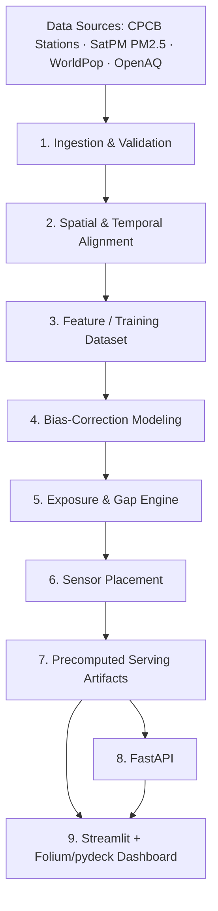

# Population-Weighted PM2.5 Exposure Gap & Monitor Placement System
### Architecture & Stage-by-Stage Build Plan

This document walks through the nine-layer architecture end to end: what each stage does, why it exists, exactly what goes in and comes out, which techniques and libraries fit, and the traps that usually bite students doing this for the first time.

---

## 1. System Diagram



**Design principle:** each layer has one job and hands the next layer a *file*, not a live object. That means you can re-run stage 5 without re-running stage 1–4, debug each stage independently, and — critically for a capstone — demo the project even if the modeling stage is still rough, because stages 7–9 just read whatever artifacts exist on disk.

---

## 2. Stage 1 — Ingestion & Validation

**Purpose:** Get four structurally different sources into a common, trustworthy tabular/raster form before anything spatial happens.

**Inputs:** CPCB station list (XLSX), SatPM PM2.5 (monthly grid, likely NetCDF or GeoTIFF), WorldPop (GeoTIFF, 100m), OpenAQ archive (CSV/JSON).

**What happens:**
- **Source loaders** — one loader function per source, each returning a standard internal shape (a DataFrame for tabular sources, an `xarray.Dataset` for gridded ones). Keep loaders isolated so a schema change in one source doesn't ripple through the others.
- **Schema checks** — enforce required columns exist with correct types: station lat/lon as floats within India's bounding box, station IDs unique, PM2.5 values numeric, dates parseable, raster CRS present and readable.
- **Range/completeness checks** — flag physically implausible PM2.5 (negative, or absurdly high e.g. >1000 µg/m³), flag population grid cells with negative counts, compute % missing readings per station per month, and check what fraction of the study period each station actually reports (CPCB/OpenAQ stations frequently have large gaps — this matters a lot later for which stations you can trust in modeling).

**Output artifacts:** validated Parquet/CSV per source + a data-quality report (station coverage %, flagged-record counts) that you'll want as an appendix in your final report — it explains and justifies later filtering decisions.

**Tools:** `pandas`, `openpyxl` (XLSX), `xarray`/`netCDF4` or `rasterio` (SatPM/WorldPop depending on format), `pandera` or hand-rolled `assert` checks for schema validation.

**Common pitfall:** silently dropping stations with sparse data instead of logging *why* — an examiner will ask how many stations you excluded and on what basis.

---

## 3. Stage 2 — Spatial & Temporal Alignment

**Purpose:** Put every layer on the same map, at the same resolution, over the same time window, so pixel-level arithmetic in later stages is actually valid.

**What happens:**
- **CRS harmonization** — reproject everything to one reference CRS. Use geographic WGS84 (EPSG:4326) for storage/interop, but reproject to a local projected CRS (UTM zone for your city, e.g. EPSG:32644 for most of India) *whenever you compute distances or areas* — IDW, kriging, and population-weighting all break subtly if done in lat/lon degrees.
- **Common grid** — SatPM (0.01°/0.1°, i.e. ~1km/11km) and WorldPop (100m) are at very different resolutions. Decide one analysis resolution (100m is natural since WorldPop is your finest layer) and resample the coarser SatPM grid onto it — bilinear interpolation for a continuous surface like PM2.5, not nearest-neighbor (which creates blocky artifacts).
- **City/ward clip** — clip the aligned rasters to the city boundary. You'll need a boundary polygon not explicitly listed in the dataset package (get it from GADM, Bhuvan, or Survey of India admin boundaries); if ward-level boundaries are available, keep them too since the placement recommendation is much more actionable at ward granularity than city-wide.
- **Station-pixel join** — for every CPCB and OpenAQ station, extract the underlying satellite-pixel and population value at that coordinate (point-in-raster sampling, not a spatial join in the vector sense).
- **Temporal alignment** — SatPM is monthly; OpenAQ/CPCB readings are hourly/daily. Aggregate ground readings to monthly means (with a minimum-completeness threshold, e.g. require ≥50% of days reporting in a month or drop that station-month) so both sides represent the same time unit.

**Output artifacts:** an aligned raster stack per city per month (GeoTIFF or NetCDF, all layers on one grid) + a station→pixel lookup table.

**Tools:** `geopandas`, `rasterio`, `rioxarray`, `pyproj`.

**Common pitfall:** aligning rasters by resampling *before* clipping (wastes compute and can shift the grid origin) — clip first with a small buffer, then resample.

---

## 4. Stage 3 — Feature / Training Dataset

**Purpose:** Build the table that stage 4 trains on: one row per station-month, satellite estimate and covariates as features, ground-truth reading as the label.

**What happens:**
- Extract satellite PM2.5 at each station's pixel for each month (your primary feature).
- Add covariates where available: AOD (aerosol optical depth, if included in SatPM's inputs), meteorology (temperature, wind speed, boundary-layer height — from ERA5 reanalysis if you have bandwidth to add it, otherwise treat as a stretch goal, not a core requirement), and station metadata (site type — industrial/residential/traffic — elevation, land-use class).
- Target column: the station's ground-truth monthly PM2.5 from CPCB/OpenAQ.
- Handle missing covariates via simple imputation (median by region) rather than dropping rows — station-months are already scarce in most Indian cities.

**Output artifact:** one training table (Parquet), documented with a data dictionary.

**Critical design decision — the split:** don't random-split rows. Split by **station** (or geographic cluster) so no station appears in both train and test — otherwise your bias-correction model looks great on paper because it's just memorizing each station's offset, and it will fail on the very unmonitored areas the whole project cares about.

---

## 5. Stage 4 — Bias-Correction Modeling

**Purpose:** Satellite PM2.5 is a good *pattern* but a biased *magnitude* — it systematically over- or under-reads relative to ground truth depending on terrain, season, and calibration. This stage learns a correction function `f(satellite, covariates) → corrected PM2.5` and applies it to every pixel in the city, not just the pixels with stations.

**What happens:**
- **Ridge regression baseline** — simple, interpretable, fast, and a fair benchmark; with very few CPCB stations per city (common in India — some cities have under 10), a heavily regularized linear model may honestly be *more* robust than anything fancier.
- **Gradient boosting** (XGBoost/LightGBM) — captures non-linear bias (e.g. bias that varies with wind speed or land-use type) if you have enough station-months to support it without overfitting.
- **Spatial cross-validation** — k-fold where folds are built from *spatial blocks* or leave-one-station-out, never random k-fold. This is the single most important methodological choice in the whole project; get this wrong and every downstream number (the "gap," the placement recommendations) is built on an optimistic illusion.
- **Model selection** — compare Ridge vs. GBM on spatial-CV RMSE, MAE, and mean bias; also plot residuals spatially — if residuals cluster geographically, the model still has an un-modeled spatial bias term worth flagging even if you don't fully fix it.

**Output artifacts:** serialized model (`joblib`), a CV report (metrics + residual maps), and feature importances (useful discussion material for the report — is the bias correction actually learning something physical, or just fitting noise from 8 stations?).

**Common pitfall:** treating a high in-sample R² as success. With a handful of stations, report CV metrics only, and be explicit in your writeup about the uncertainty this implies for the "true exposure" surface.

---

## 6. Stage 5 — Exposure & Gap Engine

This is the analytical heart of the project — where "true" and "official" exposure are each turned into one number (and one map) and compared.

**True exposure:**
1. Apply the calibrated model from Stage 4 to *every pixel* in the city grid → a bias-corrected PM2.5 raster.
2. Population-weight it:

```
PW_true = Σ(PM2.5_i × Population_i) / Σ(Population_i)     [sum over all grid cells i in the city]
```

This is the exposure estimate that matters for public health — it reflects where people actually live, not where monitors happen to be.

**Official exposure (what the monitoring network implies):**
1. Take the CPCB stations' actual readings and interpolate them across the same city grid — start with **IDW** (Inverse Distance Weighting, simple and defensible):

```
Value(x) = Σ(w_i × z_i) / Σ(w_i),   w_i = 1 / d_i^p
```

   and treat **ordinary kriging** as an upgrade if you have bandwidth (kriging also gives you a variance/uncertainty surface, which is directly useful in Stage 6).
2. Population-weight this interpolated surface the same way → `PW_official`.

**The gap:**

```
Gap        = PW_true − PW_official                    (one headline number per city)
GapSurface = TrueRaster − OfficialInterpolatedRaster   (pixel-wise map — where the gap is worst)
```

Report both. The single number is a good headline ("Delhi's official network understates population-weighted exposure by X µg/m³"), but the *spatial* gap map is what actually drives Stage 6 and is more persuasive evidence for the NCAP-funding-incentive argument in your problem statement — you can visually show *which* high-population areas are furthest from any monitor and worst-represented.

---

## 7. Stage 6 — Sensor Placement

**Purpose:** Turn the gap map into an actionable recommendation: where should the *next* monitor go?

**Approach (greedy marginal-gain placement):**
1. **Candidate generation** — a regular grid of candidate points across the city (excluding sites too close to existing stations, e.g. <1–2 km), or ward centroids if you have ward boundaries.
2. **Simulate adding a monitor** at each candidate: assume it would read the calibrated "true" PM2.5 at that pixel, add it to the station set, and re-run the Stage 5 interpolation with N+1 stations.
3. **Score each candidate** by how much it shrinks the gap:

```
ΔGap(c) = |PW_true − PW_official(before)|  −  |PW_true − PW_official(with c added)|
```

   (or, if you went the kriging route, score by *variance reduction* at high-population cells instead — kriging gives you this for free).
4. **Rank** candidates, apply simple feasibility constraints (minimum spacing, not literally on top of an existing station), and recommend the top-3 to top-5.

**Stretch goal:** instead of one-at-a-time greedy selection, frame it as a small facility-location / max-coverage problem and pick the best *set* of k new stations jointly — greedy is usually within a good bound of optimal here and is much easier to explain in a viva.

**Output artifacts:** ranked candidate table (GeoJSON/CSV) with each candidate's projected gap reduction — this is your final "recommendation" deliverable.

---

## 8. Stage 7 — Precomputed Serving Artifacts

**Purpose:** decouple the (slow, offline) analysis pipeline from the (fast, interactive) serving layer. Nobody should re-run kriging or a GBM every time someone opens the dashboard.

**What to persist, per city (and per run, versioned by date/run-id so results are reproducible):**
- **GeoParquet** — station points, candidate placement points, ward-level summary stats.
- **GeoTIFF** — the true-exposure raster, the official-interpolated raster, and the gap raster.
- **GeoJSON** — city/ward boundaries, top-k placement recommendations (lightweight enough to send straight to a web map).
- **Model artifacts** — the trained Ridge/GBM model (`joblib`), for transparency and so the API can score new "what-if" points on demand without needing the full raster.

This is what makes Stages 8–9 fast: they only ever *read* files.

---

## 9. Stage 8 — FastAPI

**Purpose:** a thin API layer between the precomputed artifacts and the dashboard (or any other client).

**Suggested endpoints:**
- `GET /cities` — list of cities available.
- `GET /cities/{city}/exposure/true` and `/exposure/official` — serve the rasters (as a tile, PNG, or Cloud-Optimized GeoTIFF).
- `GET /cities/{city}/gap` — the gap summary number + link to the gap raster.
- `GET /cities/{city}/stations` — existing CPCB/OpenAQ stations (GeoJSON).
- `GET /cities/{city}/placement/recommendations` — ranked candidate list.
- `POST /cities/{city}/placement/simulate` — optional "what-if" endpoint: pass a custom lat/lon, get a live-computed projected gap reduction using the saved model + interpolation function (this is the one endpoint that does real compute on request, and it's a nice interactive touch for a demo).

**Tools:** FastAPI + Uvicorn, Pydantic schemas for response validation, `rasterio`/`rio-tiler` if you want to serve actual map tiles rather than flat images.

---

## 10. Stage 9 — Streamlit + Folium/pydeck Dashboard

**Purpose:** the thing you actually demo.

**What it shows:**
- A city/ward selector and (if you kept multiple months) a month slider.
- Three toggleable map layers: true exposure heatmap, official exposure heatmap, and the gap (diverging color scale — red where official underestimates true exposure, blue where it overestimates).
- Existing CPCB/OpenAQ station markers.
- Highlighted top-k recommended placement sites, each clickable to show its projected gap reduction (pulled from the FastAPI `/placement/recommendations` or `/simulate` endpoint).
- A small summary panel: city-wide `PW_true`, `PW_official`, and the headline gap number.

**Tools:** Streamlit for the app shell and controls; Folium (Leaflet, simplest, good for choropleth + markers) or pydeck (deck.gl, better for large raster/heatmap layers and smoother zooming) for the map itself — Folium is the faster starting point, pydeck is the upgrade if performance becomes an issue.

---

## 11. Suggested Repository Structure

```
pm25-exposure-gap/
├── data/
│   ├── raw/                # untouched source extracts
│   ├── interim/            # validated, aligned intermediate data
│   └── processed/          # Stage 7 serving artifacts
├── src/
│   ├── ingestion/          # Stage 1 loaders + validators
│   ├── alignment/          # Stage 2
│   ├── features/           # Stage 3
│   ├── modeling/           # Stage 4 (ridge.py, gbm.py, spatial_cv.py)
│   ├── exposure_gap/       # Stage 5 (idw.py, kriging.py, gap.py)
│   └── placement/          # Stage 6
├── api/                    # Stage 8 FastAPI app
├── dashboard/               # Stage 9 Streamlit app
├── notebooks/               # exploratory work, kept separate from src/
├── reports/                 # data-quality report, CV report, final writeup
└── tests/
```

---

## 12. Suggested Build Order (6–8 week pacing)

| Week | Focus |
|---|---|
| 1 | Stage 1 (ingestion/validation) + data-quality report |
| 2 | Stage 2 (alignment) — get CRS/grid/clip right before anything else, this underpins everything |
| 3 | Stage 3 (training table) + Stage 4 baseline (Ridge, spatial CV) |
| 4 | Stage 4 (add GBM, compare, finalize model) |
| 5 | Stage 5 (IDW/kriging, gap engine) — first end-to-end true-vs-official comparison |
| 6 | Stage 6 (placement algorithm) |
| 7 | Stage 7 + 8 (serving artifacts, API) |
| 8 | Stage 9 (dashboard), polish, final report/viva prep |

If time runs short, Stages 8–9 can be compressed hardest without losing the analytical core — a Jupyter notebook that generates the same maps still demonstrates the methodology; the API/dashboard are presentation layers, not where the science lives.

---

## 13. Where This Is Genuinely Uncertain (say this explicitly in your report)

- **Sparse CPCB networks.** Many Indian cities have single-digit station counts, which caps how confidently Stage 4's spatial CV and Stage 5's interpolation can be trusted — treat interpolated "official exposure" as a modeled estimate of the network's implied coverage, not ground truth itself.
- **Resolution mismatch.** SatPM at 0.01°/0.1° vs. WorldPop at 100m means your "pixel-level" population weighting is only as fine as your coarsest resampled layer — be upfront about the effective resolution of your final numbers.
- **No city/ward boundary file was listed in the provided package** — you'll need to source one (GADM or Bhuvan) to do the city/ward clip in Stage 2.
